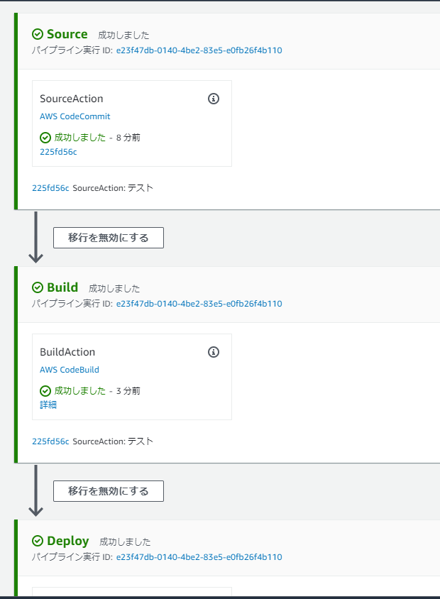

- [MkDocs-pipeline-from-codecommit-to-S3](#mkdocs-pipeline-from-codecommit-to-s3)
  - [事前準備](#事前準備)
    - [CodeCommitリポジトリの作成](#codecommitリポジトリの作成)
    - [MkDocsプロジェクトの設定](#mkdocsプロジェクトの設定)
  - [パイプラインの構築](#パイプラインの構築)
    - [CloudFormationを利用した構築手順](#cloudformationを利用した構築手順)

# MkDocs-pipeline-from-codecommit-to-S3

MkDocsプロジェクトをcodecommitからS3にデプロイするためのドキュメントパイプライン


## 事前準備

### CodeCommitリポジトリの作成

作成方法については、以下の公式ドキュメントを参照
- AWS公式マニュアル
  - https://docs.aws.amazon.com/ja_jp/codecommit/latest/userguide/how-to-create-repository.html

### MkDocsプロジェクトの設定

1. CodeCommitリポジトリをClone後、ローカル環境に以下のコマンドでMkDocsをインストールする。  
※pythonが未インストールの場合は事前にインストールする。

```bash
pip install mkdocs
pip install mkdocs-material
pip install fontawesome_markdown
```

2. リポジトリ直下に移動し、以下のコマンドでMkDocsプロジェクトを作成する。  
※例はtest-projectという名称でプロジェクトを作成する。

```bash
cd <Cloneしたリポジトリ直下のパス>
mkdocs new test-project
```

3. MkDocsプロジェクト直下に移動し、自動で作成されたmkdocs.ymlを以下のように編集する。

```yml
site_name: SampleSite

theme:
  name: 'material'
  language: ja
  features:
    #---- 各種機能カスタマイズ(ナビゲーション関連)
    - navigation.instant     ## mkdocs for MaterialのSPA対応
    - navigation.tabs        ## トップレベル項目を画面上部メニューにタブ表示
    - navigation.top         ## ページTOP遷移ボタンを有効化

    #---- 各種機能カスタマイズ(ヘッダー関連)
    - header.autohide        ## ヘッダー部分を一定量スクロールしたら隠すようにする
  #---- カラーテーマの変更  
  palette:
    primary: cyan
    accent: amber

# Navigation
nav:
    - はじめに: index.md

markdown_extensions:
    - admonition
    - fontawesome_markdown    
extra_css:
    - "https://stackpath.bootstrapcdn.com/font-awesome/4.7.0/css/font-awesome.min.css"
    - "css/custom.css"

# Copyright
copyright: 'Copyright © 2021 - サンプルサイト'
```

※ あくまで上記はサンプルであるため、マニュアルに従って適宜設定を変更すること。
- Material for Mkdocsのマニュアル
  - https://squidfunk.github.io/mkdocs-material/

4. リポジトリ直下へ移動し、以下のようにbuildspec.ymlを作成する。

```yml
version: 0.2
phases:
  install:
    runtime-versions:
      python: 3.7
    commands:
      - pip install --upgrade pip
      - pip install --upgrade awscli
      - pip install mkdocs
      - pip install mkdocs-material
      - pip install fontawesome_markdown
      - pip list
  pre_build:
    commands:
      # Discover and run unit tests in the 'tests' directory
  build:
    commands:
      # Build
      - cd test-project
      - mkdocs build
  post_build:
    commands:
      # Post Build
      - ls -al
artifacts:
  base-directory: 'test-project/site*'
  files:
    - '**/*'
```

  
※最終的なディレクトリ構造は上記のとおりとなる。

5. 最後にリモートリポジトリへ、変更をプッシュする。

## パイプラインの構築

### CloudFormationを利用した構築手順

1. このリポジトリから最新のtemplate.ymlを入手する。

2. AWS CLIを実行できる環境で、以下コマンドを使用し、CloudFormationスタックを作成する。

```bash
aws cloudformation deploy --template-file template.yml \
--stack-name <任意のスタック名> --parameter-overrides \
CodeCommitRepo=<CodeCommitリポジトリ名> \
GitHubBranch=<対象ブランチ> \
SourceIpAddressList=<S3アクセスを許可するIP>,<S3アクセスを許可するIP> \
--capabilities CAPABILITY_IAM
```

3. CloudFormationスタックの作成に成功した場合、CodePipelineが初回実行される。  
※CodePipelineを確認し、全ステージが成功していることを確認する。




4. 静的サイトをデプロイしたS3(<スタック名>-publish)へ移動し、バケットウェブサイトエンドポイントを確認する。

5. 前述の手順で確認したエンドポイントへブラウザからアクセスし、MkDocsで構築した静的サイトが表示されることを確認する。

